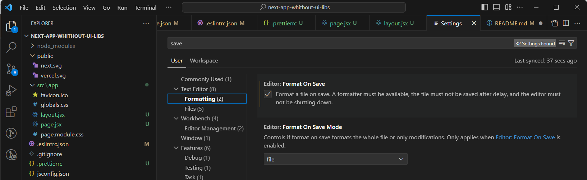

This is a [Next.js](https://nextjs.org/) project

## Getting Started

First, run the development server:

```bash
npm run dev
# or
yarn dev
# or
pnpm dev
# or
bun dev
```

Збірка next js без ui-бібліотек

Стартовий набір бібліотек:

    1)clsx - бібліотека для зручного додавання класів до jsx
    Приклад: <div className={clsx('first-class', 'second-class', {
        ["third-class"]: isOpen,
    })}>
    Чому вона, а не classnames? Вона більш нова і має значно меншу вагу і тіж самі можливості.

    2)eslint, eslint-config-airbnb, eslint-plugin-prettier - ці плагіни допоможуть писати код в одному стилі та більш чистіший, також prettier допоможе виправляти помилки та форматувати код. (Детальніше нижче)

    3)generate-react-cli - ліба яка прибере з вашого життя рутину у вигляді постійного створення папок та файлів компонентів. Однією командою ви створите собі:
        a) Файл для самого компоненту.
        б) Файл індекс для компоненту
        с) Файл стилів для компоненту
        д) Файл типів чи любий інший бо ви зможете легко налаштовувати ваш конфіг (Детальніше нижче)
        Лінка на самостійне ознайомлення https://www.npmjs.com/package/generate-react-cli

    4)@redux/toolkit react-redux - я думаю тут обійдемося без пояснень

    5)@svgr/webpack - оскільки vercel вирішив не додавати в next можливість зручно імпортувати svg as react component, то з нею буде набагато легше (Ще пошукаю інші альтернативи)

Щоб увімкнути автоматичне виправлення у vs code треба в settings в пошуку ввести save, та зліва внизу обрати вкладку formatting і поставити галочку на format on save(також потрібно щоб у вас вже стояв formatter по дефолту prettier)
(1 етап на скріні)

